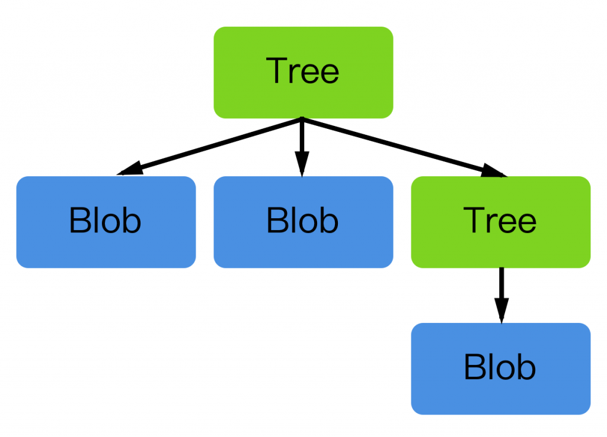

## Git 如何儲存檔案內容？
Git 儲存內容時，都是透過 git hash-object 取得 SHA1 並儲存起來，如下所示，只要檔案內容稍有變動，git hash-object 的結果就會天差地遠：

```
$ echo 'f' | git hash-object --stdin
6a69f92020f5df77af6e8813ff1232493383b708
$ echo 'fi' | git hash-object --stdin
e133fadec9f9f77fd6add0e533715d74d393eace
```

備註：事實上 git hash-object 是將「檔案內容和 Header」做 SHA1。Header 是 “blob” 加上空格、內容長度、結尾 null bytes。

```
SHA1("blob 2\u0000fi")
e133fadec9f9f77fd6add0e533715d74d393eace
```

了解了 Git 產生 SHA1 的方式，我們可以進一步把這個 SHA1 儲存起來，依循前面的例子，不一樣的是這次我們將 SHA1 儲存起來：

```
$ echo 'f' | git hash-object --stdin -w
6a69f92020f5df77af6e8813ff1232493383b708
$ echo 'fi' | git hash-object --stdin -w
e133fadec9f9f77fd6add0e533715d74d393eace
```

看起來跟前面例子輸出一樣，要怎麼驗證 SHA1 已經被 Git 儲存起來了呢？我們可以列出 .git 目錄下的 objects 資料夾內容：

```
$ tree .git/objects/
.git/objects/
├── 6a
│   └── 69f92020f5df77af6e8813ff1232493383b708
├── e1
│   └── 33fadec9f9f77fd6add0e533715d74d393eace
├── info
└── pack

4 directories, 2 files
```

我們可以看到，git hash-object 所產生的 SHA1，前面 2 個數字、字母會被切出來當成資料夾，剩餘的 38 個數字、字母當成檔名，被放置在 .git/objects 資料夾底下。

那這兩個檔案儲存的內容是什麼呢？

首先我們用 cat 這個指令來看一下內容：

```
$ cat .git/objects/6a/69f92020f5df77af6e8813ff1232493383b708
xK��OR0bH�nb
```

你沒看錯，檔案內容是亂碼。原因是因為 git 用二進制的方式將內容儲存起來，我們可以用 git 提供的指令來輕易地檢視這些內容。

```
$ git cat-file -p 6a69f92020f5df77af6e8813ff1232493383b708
f
$ git cat-file -p e133fadec9f9f77fd6add0e533715d74d393eace
fi
```

不一樣的是，git cat-file 指令要直接給整串 SHA1，而不再是目錄、檔名。然後你可以看到，結果就是我們前面給的檔案內容。

至此，你了解了 Git 是將檔案內容，加上 Header 後，產生對應的 SHA1，當成目錄、檔名，而其內容就是原始檔案的二進制內容。一旦檔案內容有所更動，SHA1 就會不一樣，反之，內容相同，SHA1 就相同。

了解這樣不夠，我們會有些疑問：

1. 萬一我有檔名、資料夾呢？哪裡會紀錄的我檔名、資料夾名稱？
2. 還有 Commit 呢？我 Commit 的內容儲存在哪？
3. Branch、Tag 儲存在哪？
4. …

不急，我們先繼續往下讀，你會在最後不經意說出「哦！原來是這樣」。

## Blob
首先，我們先介紹 git cat-file 的另一個功能，也就是檢視該 SHA1 的「類型」：

```
$ git cat-file -t 6a69f92020f5df77af6e8813ff1232493383b708
blob
$ git cat-file -t e133fadec9f9f77fd6add0e533715d74d393eace
blob
```

可以看到，前面我們所建立的兩個 SHA1 都是 blob 類型，由此可知，Git 將檔案內容轉成二進制，並產生 SHA1 儲存起來的「物件」，稱為 blob，這個很重要，請先記得。

再來，我們延續前面的內容，有了 blob 還不夠，人是貪心的，我想要存檔名、資料夾名稱時，該怎麼辦？

因此 Git 提供了另外一種「類型」，稱為 Tree。

## Tree
在了解 Tree 以前，我們先偷窺一下 Tree 的範例內容（我們沒有這些檔案，只是讓你看一下可能的內容）：

```
$ git cat-file -p 99f1a6d12cb4b6f19c8655fca46c3ecf317074e0
100644 blob a906cb2a4a904a152e80877d4088654daad0c859 README
100644 blob 8f94139338f9404f26296befa88755fc2598c289 Rakefile
040000 tree 99f1a6d12cb4b6f19c8655fca46c3ecf317074e0 lib
```

上圖 Tree 裡面，紀錄了兩個檔案（Blob）檔名及其對應的 SHA1，如果我們用 git cat-file 加上 README 的 SHA1，就可以取得 README 這個檔案的內容。而 lib 是一個資料夾，資料夾裡面可能還有其他檔案，所以用另一個 Tree 儲存這些資料。

Tree 本身也是跟 Blob 一樣，用 SHA1 當檔名，然後儲存二進制內容，但不一樣的是，Blob 儲存了我們的「檔案內容」，而 Tree 則是儲存了我們的「檔名」，甚至還包含了另一個 Tree！如下圖所示：



如此一來，有了 Tree 這個物件，我們就可以解決前面提到的問題，我們可以儲存檔案的名稱、資料夾名稱、檔案權限等等。也因為 Tree 記錄了相關連的 Blob、Tree 的 SHA1，所以我們可以輕鬆地透過 Tree，找到子目錄、子子目錄的檔案內容、名稱。

至此我們就可以大致窺探到 Git 是如何儲存一整個資料夾的內容、關聯。首先要先有 SHA1，然後再透過 Tree 的方式記錄關聯，透過 Blob 記錄檔案內容！

了解 Tree、Blob 後，我們進一步來看看 Commit 是怎麼回事。

## Commit
Commit 就和 Tree、Blob 一樣，也是擁有 SHA1 檔名，儲存在 .git/objects 目錄下，我們來看看一個 Commit 物件可能的內容：

```
$ git cat-file -p fb1298cab9b794b251e3f8ece5bc4380ab9328f8
tree d7ab14dd76c4990b64031c890f95fd9eae042c9a
author shavenking <shavenking@gmail.com> 1512874376 +0800
committer shavenking <shavenking@gmail.com> 1512874376 +0800

awesome
```

就如同 Tree、Blob 一樣，我們用 git cat-file 這個指令可以看到其儲存的內容，第一行是 Tree，接著的是該 Commit 的相關資訊（作者、Commit 訊息）。

備註：Commit 只能紀錄 Tree，不能紀錄 Blob。

讓我們直接用圖來看看加上 Commit 之後的樣子：


如果我們再新增一個 Commit 呢？請看下圖：


如果用 git cat-file 可以看到檔案內容如下：

```
$ git cat-file -p 5ed902ec9ef442ec0a9dd5fd2bf9639175539c8b
tree a031edc7aa1c34a9e46b86f64d2798d9fcb8ad03
parent fb1298cab9b794b251e3f8ece5bc4380ab9328f8
author shavenking <shavenking@gmail.com> 1512874387 +0800
committer shavenking <shavenking@gmail.com> 1512874387 +0800

awesome again
```

除了 Tree 以外，多了一個 Parent，紀錄前一個 Commit 的 SHA1，因此所有 Commit 就能串連在一起，我可以透過 git cat-file 一個一個往回找。

特別注意：Commit、Tree、Blob 都是除存在 .git/objects 裡面，以 SHA1 當檔名的二進制檔案！

了解這些之後，接下來我們再進一步說明 Branch 及 Tag 的原理。

## Branch and Tag
Branch 和 Tag 就稍微不太一樣了，他們不再是以 SHA1 當檔名的二進制檔案，取而代之的是紀錄「Commit」的 SHA1，並儲存在 .git/refs 裡面。

我們知道，git init 初始化後，Git 會幫我們建立一個 master，在我們 git commit 後，這個 master 就會出現在 .git/refs 底下，如下：

```
$ tree .git/refs/
.git/refs/
├── heads
│   └── master
└── tags

2 directories, 1 file
```

可以看到 heads 資料夾下有一個名為 master 的檔案，其內容如下：

```
$ cat .git/refs/heads/master
5ed902ec9ef442ec0a9dd5fd2bf9639175539c8b
```

注意到了嗎？master 這個檔案（也就是 Branch），記錄了 Commit 的 SHA1，所以如果我們用 git cat-file 繼續追蹤的話，你就會看到下列內容：

```
$ git cat-file -p 5ed902ec9ef442ec0a9dd5fd2bf9639175539c8b
tree a031edc7aa1c34a9e46b86f64d2798d9fcb8ad03
parent fb1298cab9b794b251e3f8ece5bc4380ab9328f8
author shavenking <shavenking@gmail.com> 1512874387 +0800
committer shavenking <shavenking@gmail.com> 1512874387 +0800

awesome again
```

由此可見，分支只不過是一個指標，指向某一個 Commit，所以此時如果我建立另外一個分支，就會長這樣：

```
$ git branch dev
$ tree .git/refs
.git/refs
├── heads
│   ├── dev
│   └── master
└── tags

2 directories, 2 files

$ cat .git/refs/heads/dev
5ed902ec9ef442ec0a9dd5fd2bf9639175539c8b

$ git cat-file -p 5ed902ec9ef442ec0a9dd5fd2bf9639175539c8b
tree a031edc7aa1c34a9e46b86f64d2798d9fcb8ad03
parent fb1298cab9b794b251e3f8ece5bc4380ab9328f8
author shavenking <shavenking@gmail.com> 1512874387 +0800
committer shavenking <shavenking@gmail.com> 1512874387 +0800

awesome again
```

可以看到，Git 只是幫我們新增了一個「Branch」檔案，紀錄了 Commit 的 SHA1！如果用圖表示的話，就會長這樣：


那 Tag 呢？也是同樣的道理，我們直接用實例來看：

```
$ git tag v1
$ tree .git/refs
.git/refs
├── heads
│   ├── dev
│   └── master
└── tags
    └── v1

2 directories, 3 files
$ cat .git/refs/tags/v1
5ed902ec9ef442ec0a9dd5fd2bf9639175539c8b
```

可以看到，Tag 也只是一個檔案，紀錄了某個 Commit 的 SHA1，那 Branch 和 Tag 差在哪裡呢？

簡單來說，Branch 會一直跟著新的 Commit 成長，而 Tag 則是永遠記錄同一個 Commit，直到海枯石爛。

我們可以簡單地再新增一個 Commit 來看看就能明白了。

首先看到我增加了第三個 Commit：

```
$ git log
commit ec40ddb953522ca3cba864736e3b2a01e426992b
Author: shavenking <shavenking@gmail.com>
Date:   Sun Dec 10 11:14:33 2017 +0800

    new commit

commit 5ed902ec9ef442ec0a9dd5fd2bf9639175539c8b (tag: v1, dev)
Author: shavenking <shavenking@gmail.com>
Date:   Sun Dec 10 10:53:07 2017 +0800

    awesome again

commit fb1298cab9b794b251e3f8ece5bc4380ab9328f8
Author: shavenking <shavenking@gmail.com>
Date:   Sun Dec 10 10:52:56 2017 +0800

    awesome
```

此時我們看看 .git/refs 目錄結構：

```
$ tree .git/refs
.git/refs
├── heads
│   ├── dev
│   └── master
└── tags
    └── v1

2 directories, 3 files
```

沒錯，還是維持一樣，改變的只是檔案內容，還記得我們的 master 跟 v1 都指向第二個 Commit 嗎？一旦我們新增第三個 Commit，我們就能看出差異了：

```
$ cat .git/refs/heads/master
ec40ddb953522ca3cba864736e3b2a01e426992b
$ cat .git/refs/tags/v1
5ed902ec9ef442ec0a9dd5fd2bf9639175539c8b
```

可以清楚地看到，Branch 隨著我的新 Commit 而隨時更改，反之 Tag 則是待在原地呆呆地守住他的幸福。此時的圖長這樣：


由以上描述可見，一旦你在某個 Branch 有新的 Commit 時，Git 就會自動更新該 Branch 檔案，紀錄最新的 Commit。而 Tag 則是一旦指定 Commit 後，就不會因為有任何新 Commit 而影響。

最後，還有一個關鍵的檔案，就是 .git 目錄下的 HEAD。

## HEAD
我們有那麼多 Branch、Tag、Commit，我們怎麼知道我們現在在哪裡？Git 又怎麼知道該顯示哪些檔案？

所以才需要 HEAD 這個檔案，記錄我們目前所在的位置。

我們可以看一下，如果我們在 master 時，HEAD 的檔案內容顯示：

```
$ cat .git/head
ref: refs/heads/master
```

就如同 Branch、Tag 的運作方式，HEAD 這個檔案僅僅是儲存了一個指標，告訴我們目前所在的位置，如果用圖表示就會長這樣：


## 回想基本指令
我們了解以上內容後，我們可以來回想一下日常生活中，我們用的 Git 指令。

* git add：建立 Tree、Blob 物件，準備稍後 git commit 時使用。
* git commit：就如同該指令名稱，我們建立了一個 Commit 的檔案儲存在 .git/objects。
* git branch：建立 Branch 檔案，紀錄某個 Commit SHA1，並儲存在 .git/refs。
* git tag：建立 Tag 檔案，紀錄某個 Commit SHA1，並儲存在 .git/refs。
* git checkout：這個指令可以指定 Branch、Tag、Commit 的 SHA1，也就是說你能把目前的位置（HEAD），指向任一個 Branch、Tag、Commit，讓你擁有穿梭未來、過去的能力。