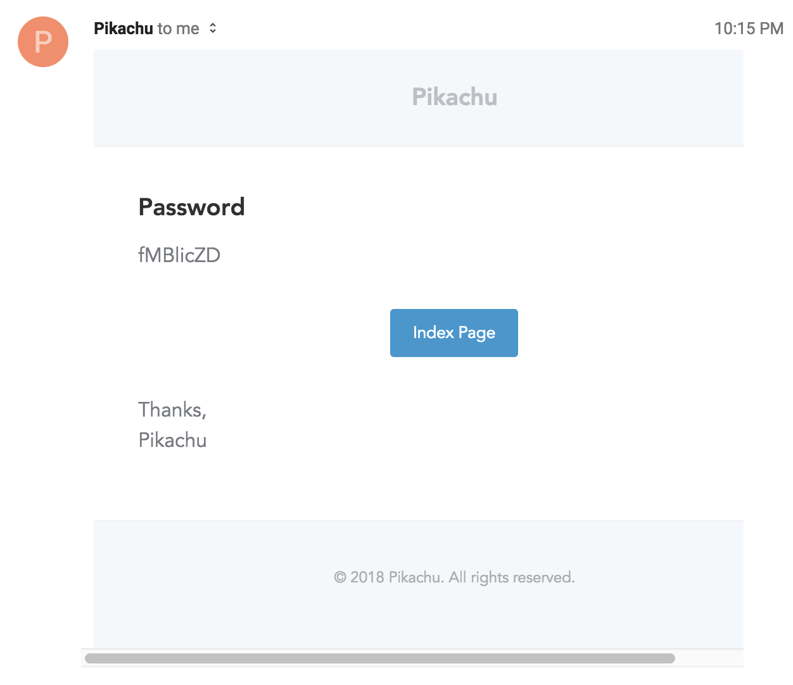

安裝 Guzzle Http，必要！

    composer require guzzlehttp/guzzle

如果有固定的 Email 發信信箱，可以設定 .env 中的兩個參數

    MAIL_FROM_ADDRESS=
    MAIL_FROM_NAME=

如果是使用 Mailgun 的服務，可以設定以下參數

    MAIL_DRIVER=mailgun
    MAIL_HOST=
    MAIL_PORT=
    MAIL_USERNAME=null
    MAIL_PASSWORD=null
    MAIL_ENCRYPTION=null
    
    MAILGUN_DOMAIN=
    MAILGUN_SECRET=

注意 MAIL_HOST、MAIL_PORT 等等都設為空，用 Mailgun（HTTP）API。

接下來可以用 artisan 指令產生 Mailable 物件，如下：

    php artisan make:mail PackageDelivered

該物件用以定義每種寄信的物件，比方說在貨物發送後，會寄一封信的話，可以建立一個 PackageDelivered 的 Mailable 物件，並在 Controller 中，用下列方式寄信：

    Mail::to($request->user())->send(new PackageDelivered($package));

## 實際案例：寄送系統產生的使用者密碼

使用情景：

- 使用者註冊時填入信箱，並由系統自動產生一組亂數密碼，寄送至信箱，用以驗證使用者為信箱擁有者
- 使用者忘記密碼時，寄送一組系統新產生的的亂數密碼至信箱

首先先建立一個 Mailable 物件，並使用 Markdown 樣板（主要是需要 Laravel 內建的樣板），如下：

    php artisan make:mail SendPassword --markdown=emails.send-password

因為寄送信件時，需要一組「密碼」，到時候要顯示在信件中，所以要加入一個 public property，如下：

    public $password;
    
    public function __construct($password)
    {
        $this->password = $password;
    }

接下來在 View 中就可以使用這組 $password 變數，如下：

    @component('mail::message')
    # Password
    
    {{ $password }}
    
    @component('mail::button', ['url' => route('index')])
    Index Page
    @endcomponent
    
    Thanks, 
    {{ config('app.name') }}
    @endcomponent

最後在 Controller 加上下面這行，就能將信件寄出：

    Mail::to($user)->send(new SendPassword($password));

